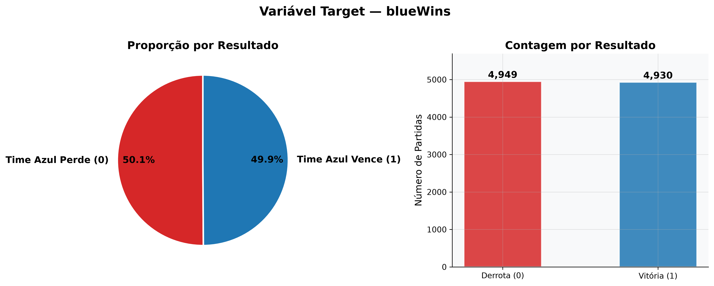
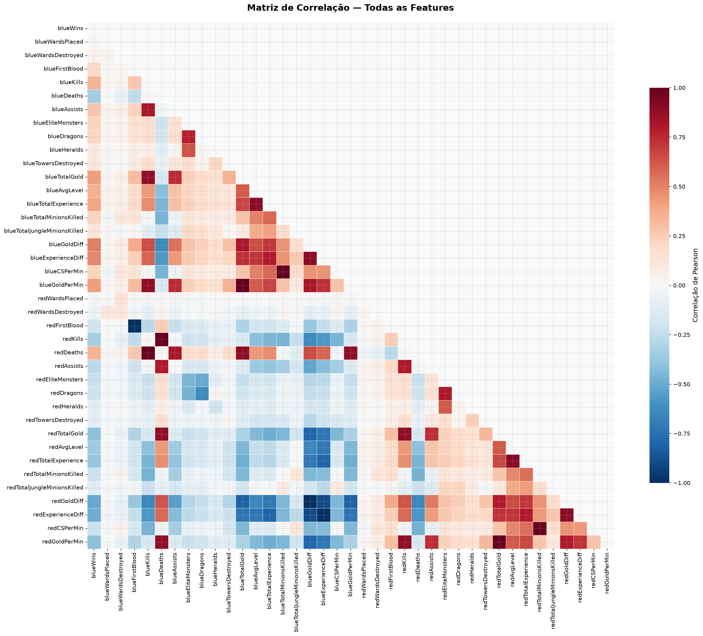
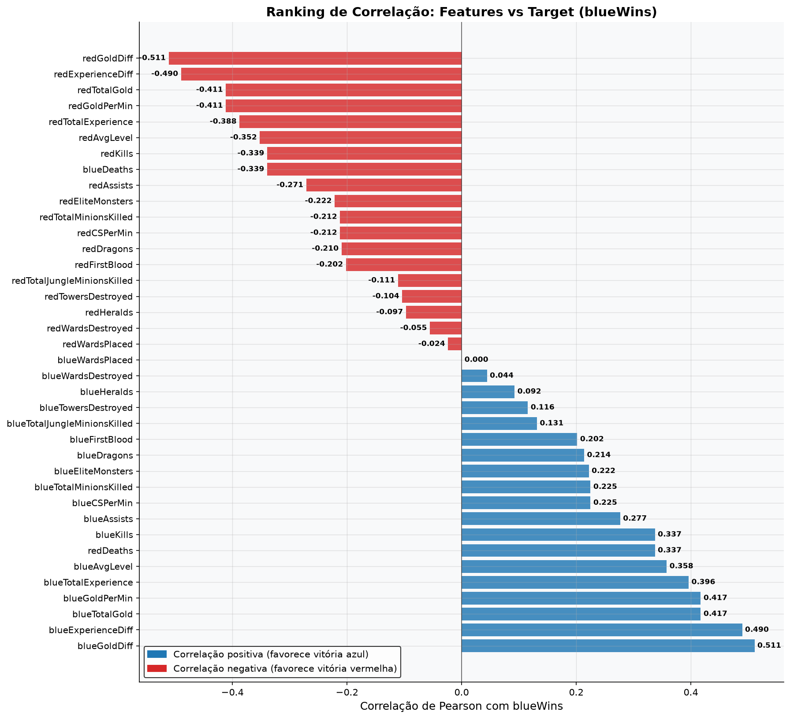
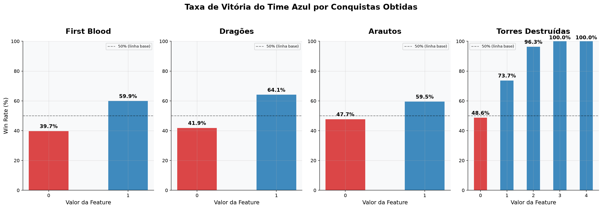
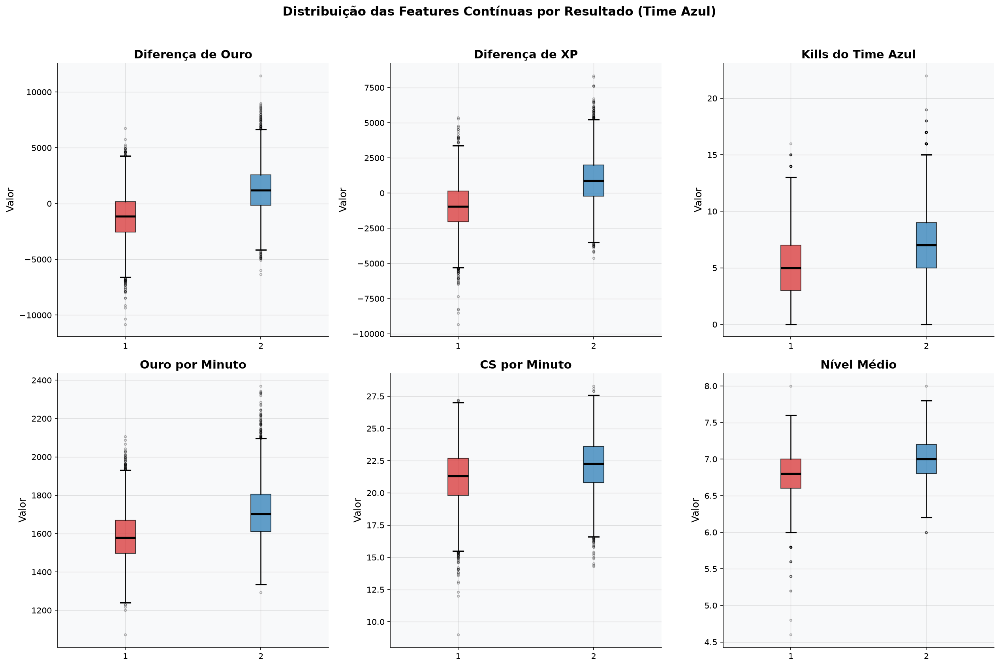
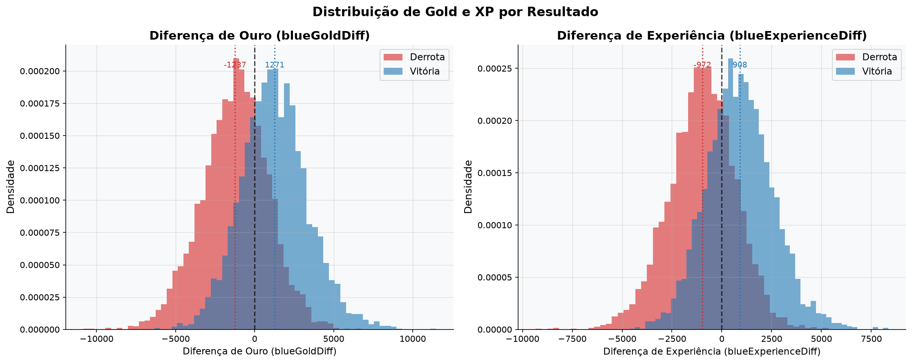
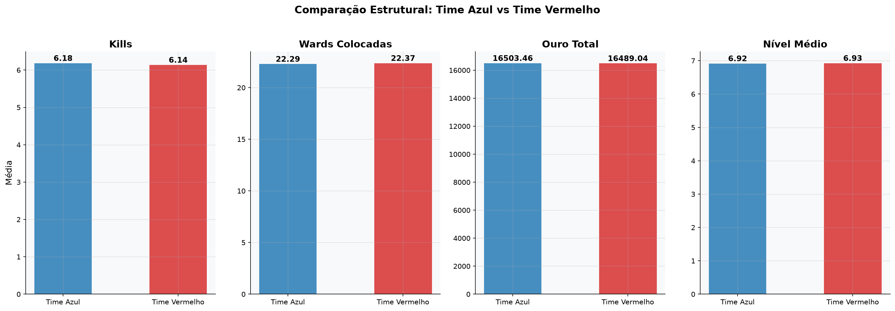

# Dados & Exploração

## A base de dados

**9.879 partidas** ranqueadas de League of Legends, com **40 colunas**, capturando o estado exato do jogo aos **10 minutos** — muito antes do fim da partida. Sem valores nulos.

O alvo (`blueWins`) está quase perfeitamente balanceado, o que evita a necessidade de qualquer técnica de balanceamento de classes:

<figure markdown>
  
  <figcaption>4.949 derrotas (50,1%) vs. 4.930 vitórias (49,9%) do time azul</figcaption>
</figure>

## O que mais se correlaciona com a vitória

A matriz de correlação completa mostra alguns blocos bem definidos — principalmente entre ouro, XP e CS (farm), que caminham juntos, como esperado:

<figure markdown>
  
  <figcaption>Matriz de correlação de Pearson entre todas as 39 features numéricas</figcaption>
</figure>

Isolando a correlação de cada feature com o resultado (`blueWins`), o ranking já entrega o primeiro insight forte do projeto — **economia (ouro e XP) domina tudo**:

<figure markdown>
  
  <figcaption><code>blueGoldDiff</code> (0,511) e <code>blueExperienceDiff</code> (0,490) lideram — bem à frente de kills, dragões ou wards</figcaption>
</figure>

## Conquistas de jogo × taxa de vitória

Cada objetivo conquistado pelo time azul aumenta a taxa de vitória — mas em proporções bem diferentes:

<figure markdown>
  
  <figcaption>First blood, dragões e arautos têm efeito moderado; torres destruídas aos 10 minutos praticamente sentenciam o jogo</figcaption>
</figure>

Vale destacar: **destruir 2+ torres antes do minuto 10 correlaciona com 96–100% de taxa de vitória** — mas isso é raro (poucas partidas chegam a esse ponto tão cedo), então essa feature acaba pesando menos no modelo do que sua taxa de vitória isolada sugeriria.

## Distribuições contínuas

Olhando as distribuições completas (não só a correlação), dá pra ver a mesma história: quem vence tem medianas de ouro, XP, kills e CS mais altas — mas com **bastante sobreposição** entre os dois grupos. Não existe uma única feature que separe vitória de derrota sozinha:

<figure markdown>
  
  <figcaption>Distribuição de diferença de ouro, XP, kills, gold/min, CS/min e nível médio, por resultado</figcaption>
</figure>

A diferença de ouro e de XP, especificamente, mostra picos de densidade bem deslocados entre vitória e derrota:

<figure markdown>
  
  <figcaption>Mediana de <code>blueGoldDiff</code>: -1.237 nas derrotas vs. +1.271 nas vitórias. Mesmo padrão em XP.</figcaption>
</figure>

## O mapa é simétrico — e os dados confirmam

Antes de seguir para a modelagem, valeu conferir se não havia viés estrutural entre os lados do mapa (azul vs. vermelho). Não há:

<figure markdown>
  
  <figcaption>Kills, wards, ouro e nível médio são estatisticamente equivalentes entre os dois lados — a vantagem vem do <em>desempenho</em>, não do lado do mapa</figcaption>
</figure>

!!! success "Insight principal desta etapa"
    A vitória em League of Legends aos 10 minutos é, antes de mais nada, uma **questão de economia**: ouro e experiência acumulados (e a diferença deles entre os times) carregam muito mais sinal preditivo do que qualquer evento isolado como first blood ou uma kill a mais.

[:octicons-arrow-right-24: Ver a modelagem](03-modelagem.md){ .md-button .md-button--primary }
