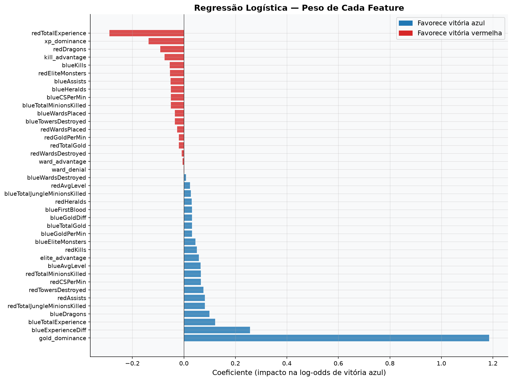
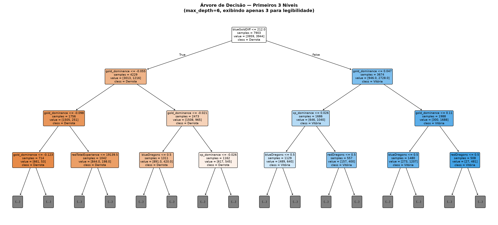
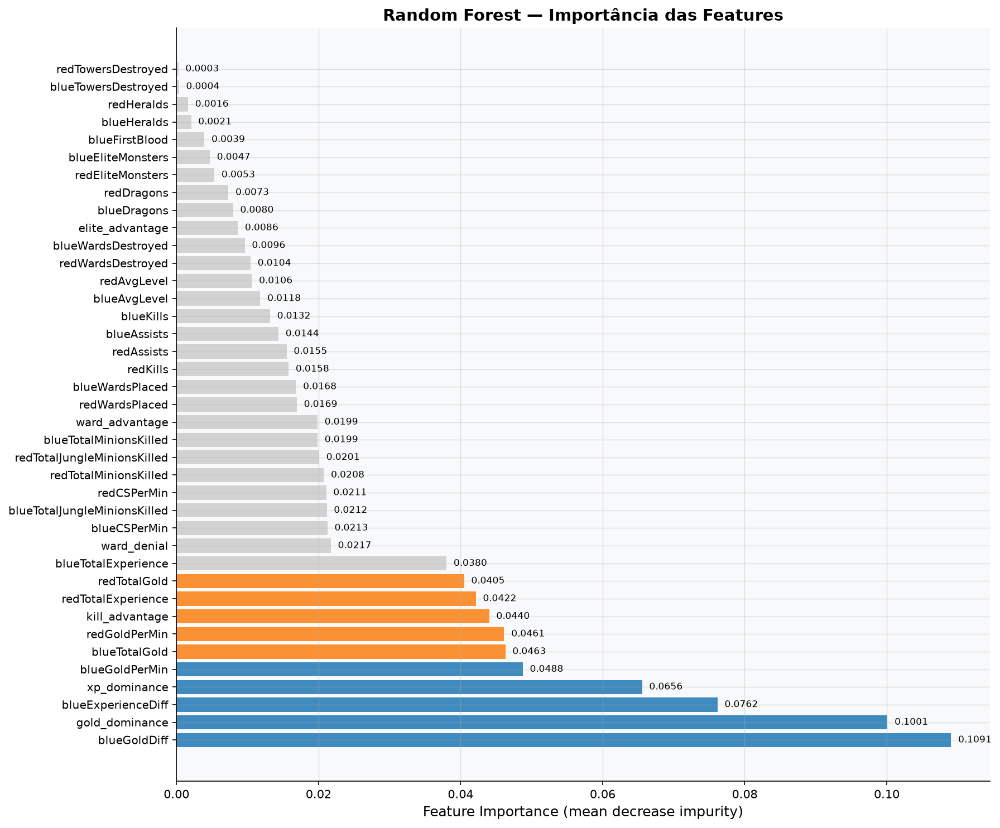
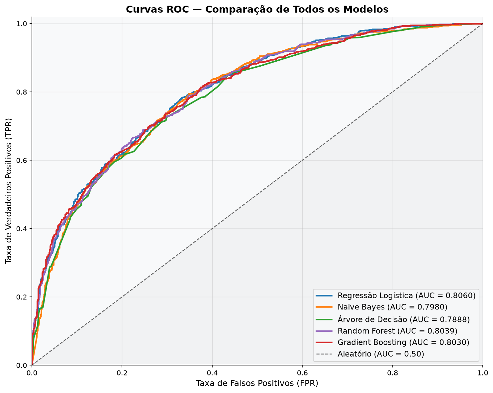
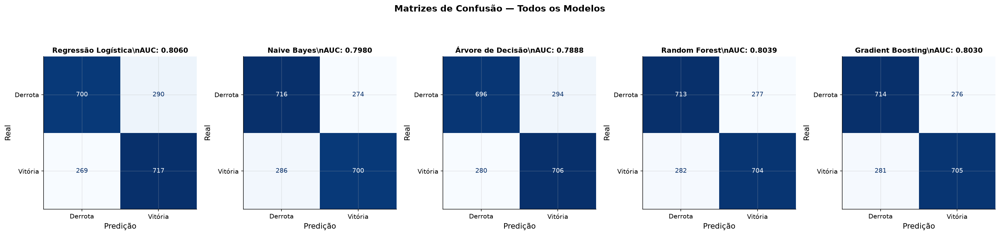
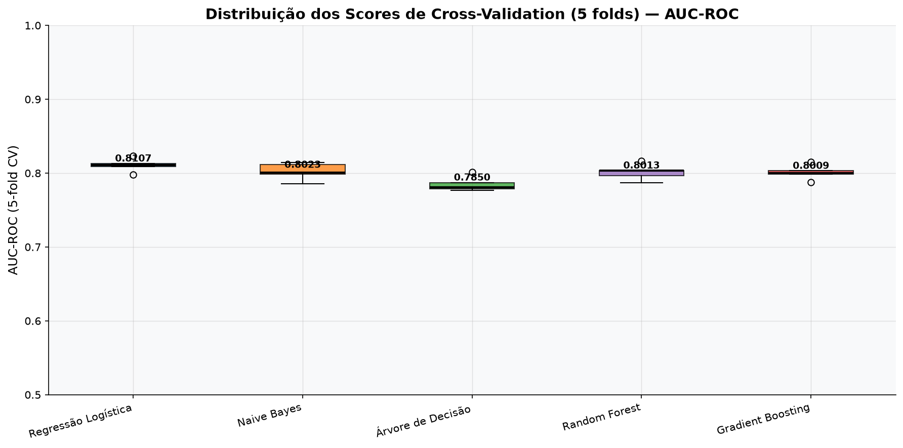

# Modelagem

## Limpeza dos dados

Seis colunas foram removidas antes do treino:

| Coluna removida | Motivo |
|---|---|
| `gameId` | Identificador, sem valor preditivo |
| `blueDeaths` | Espelho exato de `redKills` |
| `redFirstBlood` | Espelho exato (inverso) de `blueFirstBlood` |
| `redDeaths` | Espelho exato de `blueKills` |
| `redGoldDiff` | Espelho exato (inverso) de `blueGoldDiff` |
| `redExperienceDiff` | Espelho exato (inverso) de `blueExperienceDiff` |

Manter essas colunas não vazaria informação do futuro (elas são de dados legítimos aos 10 minutos), mas são **redundantes**: cada uma é uma transformação linear exata de outra coluna já presente. Removê-las simplifica o modelo sem perder informação.

## Engenharia de features

Seis novas features foram criadas a partir das colunas originais, todas expressando **vantagem relativa entre os times** em vez de valores absolutos:

| Feature nova | Fórmula | Ideia |
|---|---|---|
| `kill_advantage` | `blueKills - redKills` | Vantagem líquida em abates |
| `ward_advantage` | `blueWardsPlaced - redWardsPlaced` | Vantagem em visão de mapa |
| `elite_advantage` | `blueEliteMonsters - redEliteMonsters` | Vantagem em objetivos elite (dragão + arauto) |
| `gold_dominance` | `blueGoldDiff / (ouro total da partida)` | Vantagem de ouro **normalizada** — 10% de vantagem pesa igual cedo ou tarde |
| `xp_dominance` | `blueExperienceDiff / (XP total da partida)` | Mesma ideia, para experiência |
| `ward_denial` | `blueWardsDestroyed / (redWardsPlaced + 1)` | Eficiência em negar visão do adversário |

A mais importante do lote acabou sendo `gold_dominance`. Já no primeiro modelo treinado (uma Regressão Logística de referência, sem tuning), ela apareceu como o coeficiente de maior magnitude — mais forte até que `blueGoldDiff`, a coluna original da qual deriva:

<figure markdown>
  
  <figcaption>Regressão Logística de referência (sem tuning): <code>gold_dominance</code> já desponta como a feature mais influente</figcaption>
</figure>

Uma Árvore de Decisão treinada nos mesmos dados "descobre" o mesmo padrão sozinha — o primeiro corte da árvore é em `blueGoldDiff`, e quase todos os cortes seguintes são em `gold_dominance`:

<figure markdown>
  
  <figcaption>Os 3 primeiros níveis da árvore (de 6 no total) giram quase inteiramente em torno de ouro</figcaption>
</figure>

E a importância de features do Random Forest confirma a mesma hierarquia por um caminho totalmente diferente (redução média de impureza, agregada em 100+ árvores):

<figure markdown>
  
  <figcaption><code>blueGoldDiff</code>, <code>gold_dominance</code>, <code>blueExperienceDiff</code> e <code>xp_dominance</code> dominam o topo do ranking</figcaption>
</figure>

Três modelos diferentes, três métodos de importância diferentes, mesma conclusão — um sinal forte de que essa hierarquia é real, não coincidência do algoritmo.

## Os 5 modelos

Como pedido no briefing, o ponto de partida foram **modelos simples**: Regressão Logística, Naive Bayes e Árvore de Decisão. Como bônus, dois métodos de ensemble entraram na comparação: Random Forest e Gradient Boosting.

Todos os 5 foram treinados no mesmo split (80/20, estratificado) e avaliados com a métrica pedida no briefing — **AUC-ROC**:

<figure markdown>
  
  <figcaption>Todos os modelos superam claramente o classificador aleatório, com AUC-ROC entre 0,79 e 0,81</figcaption>
</figure>

As matrizes de confusão mostram que os erros também estão equilibrados entre as duas classes — nenhum modelo "empurra" a previsão sistematicamente para um dos lados:

<figure markdown>
  
  <figcaption>~1.976 partidas no conjunto de teste, distribuídas de forma equilibrada entre acertos e erros para ambas as classes</figcaption>
</figure>

## Por que confiar nesses números: validação cruzada

Um único split de teste pode enganar — pode ter calhado de ser "fácil" ou "difícil" por acaso. Por isso, todos os modelos passaram por **validação cruzada de 5 folds**, como sugerido no briefing:

<figure markdown>
  
  <figcaption>AUC-ROC médio por modelo em 5 folds — a Regressão Logística lidera (0,8107) e tem a distribuição mais estreita entre os 5</figcaption>
</figure>

| Modelo | AUC-ROC (teste) | AUC-ROC (CV, 5-fold) |
|---|---|---|
| **Regressão Logística** | 0,8060 | **0,8107** |
| Naive Bayes | 0,7980 | 0,8023 |
| Árvore de Decisão | 0,7888 | 0,7850 |
| Random Forest | 0,8039 | 0,8013 |
| Gradient Boosting | 0,8030 | 0,8009 |

A validação cruzada é o número que mais importa aqui — ela é a estimativa mais confiável do desempenho em dados novos. E ela aponta pra um resultado interessante: a **Regressão Logística**, o modelo mais simples do lote, não só empata tecnicamente com os ensembles como tem a **distribuição mais estreita** entre os 5 — ou seja, o desempenho mais consistente entre diferentes fatias dos dados.

Em seguida, os três modelos mais competitivos (Regressão Logística, Random Forest e Gradient Boosting) passaram por `GridSearchCV` para otimização de hiperparâmetros, buscando extrair o máximo de cada um antes da escolha final.

[:octicons-arrow-right-24: Ver o modelo final e os resultados](04-resultados.md){ .md-button .md-button--primary }
