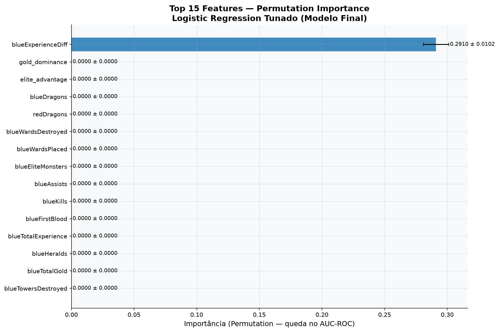
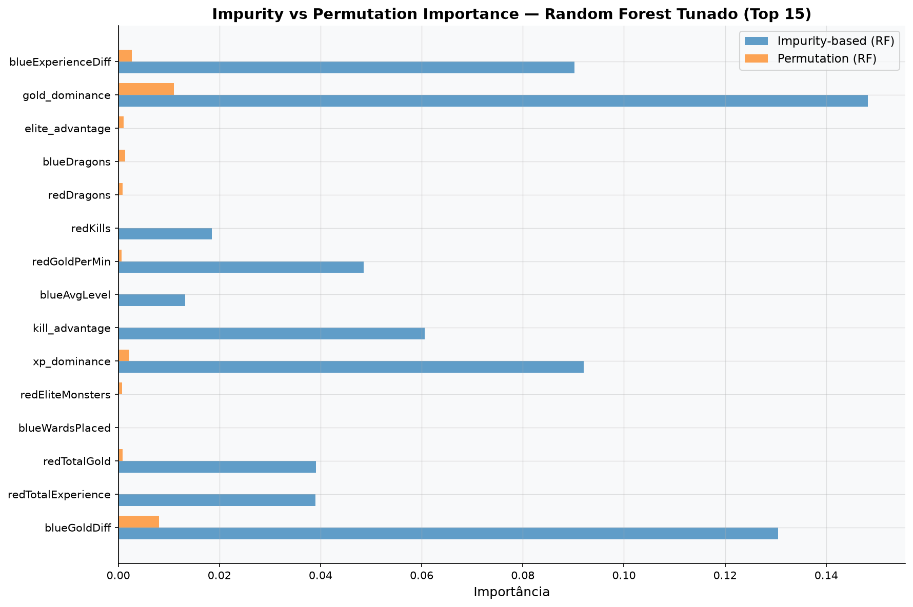
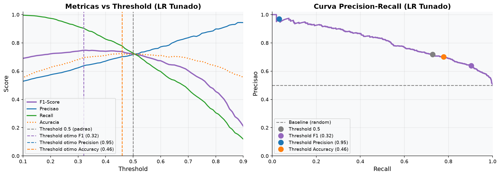

# Modelo Final

## O campeão: Regressão Logística tunada

Depois do `GridSearchCV` (aplicado à Regressão Logística, ao Random Forest e ao Gradient Boosting), o modelo escolhido foi a **Regressão Logística**:

| | |
|---|---|
| **Hiperparâmetros** | `C=0.01`, `penalty='l1'`, `solver='saga'`, `max_iter=2000` |
| **AUC-ROC (teste)** | **0,8065** |
| **AUC-ROC (CV, 5-fold)** | **0,8117** |
| **Threshold operacional** | **0,32** (otimizado para F1-Score) |

!!! question "Por que a Regressão Logística, e não um ensemble?"
    O Random Forest tunado chegou perto — AUC ≈ 0,806 no teste — praticamente um empate técnico. Diante de uma diferença tão pequena, três critérios desempataram a favor da Regressão Logística:

    1. **Ela já vencia na validação cruzada** (0,8117), a métrica mais confiável, com a distribuição mais consistente entre os 5 modelos candidatos.
    2. **É totalmente interpretável** — cada coeficiente tem leitura direta, o que importa numa apresentação para stakeholder de negócio.
    3. **Vai na linha do que a própria Bárbara sugeriu no briefing**: "modelos mais simples" antes de recorrer a algo mais pesado.

    Nenhum modelo aqui é "ruim" — os 5 ficaram entre AUC 0,785 e 0,811. A escolha final é sobre o melhor equilíbrio entre desempenho, simplicidade e interpretabilidade, não sobre uma vitória esmagadora.

## A descoberta mais interessante do projeto

O `GridSearchCV` escolheu uma regularização **L1 (Lasso)** bem forte (`C=0.01`). Isso tem uma consequência direta: L1 **zera** o coeficiente de qualquer feature que não agregue informação nova além do que as outras já capturam.

O resultado: das **39 features** usadas no treino, o modelo final considera apenas **5**:

| Feature | O que é | Coeficiente |
|---|---|---|
| `gold_dominance` | Vantagem de ouro, normalizada pelo ouro total da partida | **+0,940** |
| `blueExperienceDiff` | Diferença de XP entre os times | +0,375 |
| `blueDragons` | Dragões abatidos pelo time azul | +0,113 |
| `redDragons` | Dragões abatidos pelo time vermelho | −0,093 |
| `elite_advantage` | Vantagem em objetivos elite (dragão + arauto) | +0,033 |

Todas as outras 34 — wards, assists, CS, nível médio, first blood, torres destruídas... — ficaram com coeficiente exatamente **zero**. Não porque sejam irrelevantes isoladamente (vimos na exploração que várias têm correlação real com a vitória), mas porque `gold_dominance` e `blueExperienceDiff` já carregam a mesma informação de forma mais eficiente — ouro e XP são, em essência, um resumo de tudo que aconteceu na partida até aquele ponto (kills, farm, objetivos).

A importância por permutação do modelo final confirma isso de forma ainda mais direta — na prática, quase toda a capacidade preditiva do modelo está concentrada em uma única feature:

<figure markdown>
  
  <figcaption><code>blueExperienceDiff</code> é responsável por 0,29 de queda no AUC-ROC quando embaralhada — todas as outras, efetivamente zero</figcaption>
</figure>

!!! success "Não é um artefato só da Regressão Logística"
    O mesmo padrão aparece no **Random Forest tunado** — um algoritmo completamente diferente, sem regularização L1. A importância por impureza (como as árvores decidem os cortes internamente) está espalhada entre várias features, mas a importância por **permutação** (o que realmente importa para o poder preditivo no mundo real) se concentra quase inteiramente em `gold_dominance` e `blueExperienceDiff`:

    <figure markdown>
      
      <figcaption>Barras azuis (impureza) espalhadas; barras laranjas (permutação, o que de fato importa) concentradas em ouro e XP</figcaption>
    </figure>

    Dois algoritmos, dois métodos de importância, mesma conclusão: **economia de time é, disparadamente, o sinal mais forte aos 10 minutos de jogo.**

## Ajustando o threshold de decisão

Por padrão, um classificador binário decide pelo threshold 0,5. Mas esse valor raramente é o melhor para o problema de negócio — ele só seria ideal se os custos de falso positivo e falso negativo fossem idênticos, o que raramente é o caso.

Testando diferentes limiares nas métricas de precisão, recall, F1-Score e acurácia:

<figure markdown>
  
  <figcaption>threshold = 0,32 maximiza o F1-Score — equilíbrio entre não perder vitórias reais e não gerar alarmes falsos demais</figcaption>
</figure>

O threshold escolhido para uso operacional foi **0,32**, otimizado para F1-Score — prioriza capturar a maioria das vitórias reais do time azul, aceitando uma taxa um pouco maior de falsos positivos em troca. Para outros contextos de uso, dois thresholds alternativos também ficaram documentados: **0,95** (se o objetivo for precisão máxima — só sinalizar quando a confiança for muito alta) e **0,46** (se o objetivo for maximizar acurácia geral).

[:octicons-arrow-right-24: Testar o modelo no simulador](05-simulador.md){ .md-button .md-button--primary }
